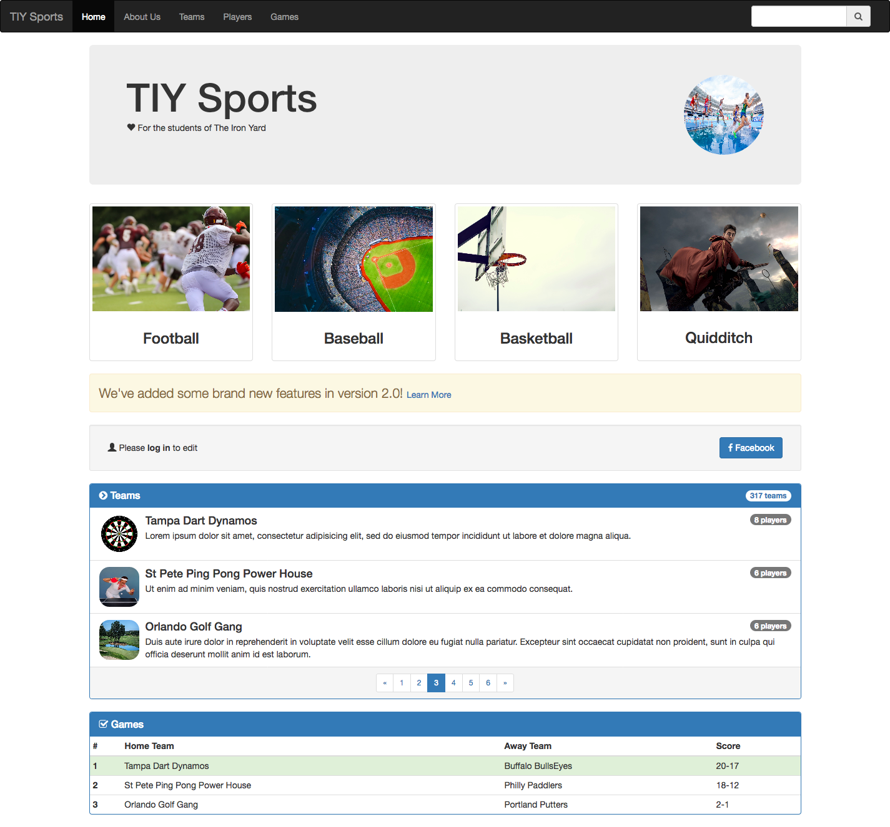
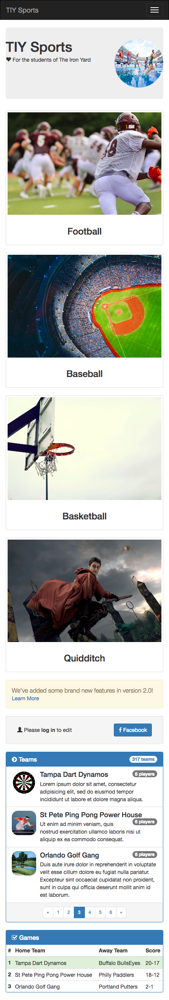

# Bootstrap

Welcome to TIY Sports, the top sport tracking website for The Iron Yard student, staff, and alumni. We will be building the most elaborate system for tracking the various teams and sports we love to play here at TIY.

However, before we can get started implementing our features we need to validate our visual design.

Our illustrious designer, B. Strap, has provided us with the following mockups for what the site should look like in both mobile and desktop forms. We also have the original image assets used in the mockup.

Our task is to reproduce this design!

## Desktop view

## Mobile view

# Explorer Mode

- Use [bootstrap](http://getbootstrap.com) to reproduce the design
- You do not need to add *any* additional CSS to achieve this design
- All of the assets have been provided for you including a skeleton `index.html` file
- Do not vary from the design as provided, add nothing, and leave nothing out. Your design doesn't need to be pixel perfect, but with bootstrap it shouldn't be far off.

# Adventure Mode

- Keeping the same design feel, add more to the site. What other information could be added and how could we utilize bootstrap components to layout and style those.
